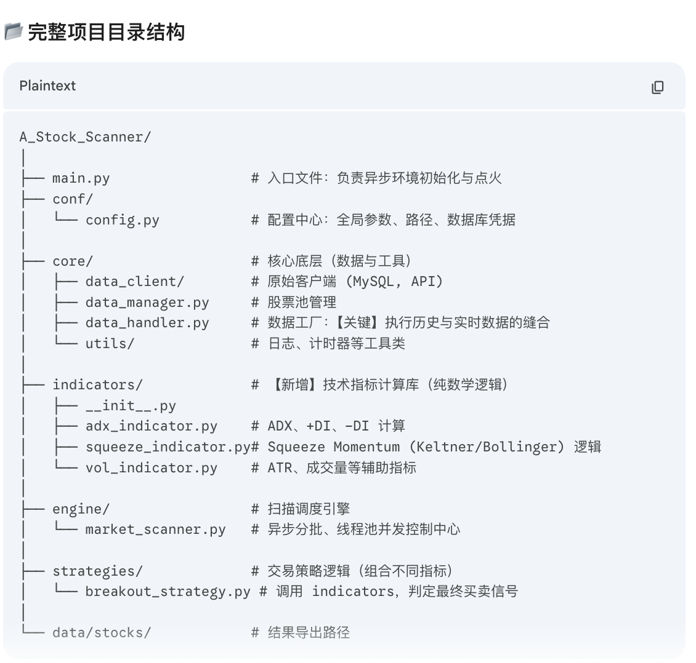

<div align="center">

# A 股量化突破扫描系统

轻量、可扩展的全市场异步扫描引擎，聚焦“挤压 + 趋势 + 突破”的高胜率交易型信号。



<br/>

[](https://www.python.org/)
[](#许可协议)
[](#)
[](#)

</div>

---

## 目录

- 概览
- 功能亮点
- 项目结构
- 安装与运行
- 配置详解（conf/config.py）
- 策略清单与说明（conf/registry.py）
- 运行与导出结果
- 常见问题（FAQ）
- 贡献 & 许可

---

## 概览

本项目是一个针对 A 股市场的全市场因子/信号扫描器：

- 基于本地 MySQL 的历史日线数据（支持前复权/后复权），可选叠加实时快照；
- 使用异步分批并发扫描，全市场 5000+ 只股票依然具备良好吞吐；
- 聚焦“挤压（Squeeze）+ 动量 + 趋势过滤（如 ADX、MA200）”的多维共振；
- 输出命中标的 CSV 并可选邮件/Telegram 推送，支持二次分析与复盘。

---

## 功能亮点

- 异步批处理：按批次切分代码池，避免 I/O 挤压与 API/数据库限流；
- 指标链式计算：`indicators/` 目录下统一封装，策略可自由组合；
- 策略注册表：新增策略只需在 `conf/registry.py` 注册即可被系统识别；
- 结果增强：实时注入名称、换手、市值等信息（可关）；
- 导出友好：CSV 使用 `utf-8-sig`，Excel 打开不乱码；
- 日志完整：运行日志每天归档到 `data/logs/YYYYMMDD/`，方便排查。

---

## 项目结构

```
stock/
├─ app.py                     # 启动入口（异步并发扫描）
├─ conf/
│  ├─ config.py               # 运行/系统/路径/数据库/通知配置
│  └─ registry.py             # 策略注册表
├─ core/
│  ├─ data_client/            # 数据访问（如 MySQL 客户端）
│  ├─ utils/                  # 日志、计时、其他工具
│  └─ data_manager.py         # 股票池名单管理
├─ engine/
│  └─ market_scanner.py       # 扫描调度与并发执行
├─ indicators/                # 指标计算
├─ strategies/                # 交易策略实现
├─ scripts/
│  ├─ stock_query.py          # 从 MySQL 查询历史日线的示例接口
│  └─ stock_daily_etl_sync.py # 日线增量/同步脚本（如需）
├─ data/
│  ├─ stocks/YYYYMMDD/        # 当日扫描输出 CSV 存放目录
│  ├─ logs/YYYYMMDD/          # 运行日志
│  ├─ cache/                  # 中间缓存
│  └─ pinescripts/            # Pine 辅助脚本（可选）
└─ quant.png                  # README 顶图
```

---

## 安装与运行

前置条件：

- Python 3.11+
- MySQL 8.0+（提供历史日线数据表，如 `asian_quant_stock_daily`）

安装建议（示例）：

```bash

~/Desktop $ python3.11 -m venv /Users/xxx/Desktop/stock/venv311

source /Users/xxx/Desktop/stock/venv311/bin/activate

deactivate

pip install pandas numpy sqlalchemy pymysql akshare aiohttp requests python-telegram-bot
```

启动扫描：

```bash
python app.py
```

运行后：

- 终端会显示当前运行模式（全量/抽样）、批次进度等；
- 命中结果将导出到 `data/stocks/YYYYMMDD/stock-*.csv`；
- 日志写入 `data/logs/YYYYMMDD/*.log`。

---

## 配置详解（conf/config.py）

关键段落如下：

1) 策略选择

```python
STRATEGY_CONFIG = {
    "RUN_STRATEGY": "squeeze_adx",  # 到 conf/registry.py 选择
    "HISTORY_END_DAY": "",          # 历史截止日（用于回测型验证；与实时互斥）
}
```

2) 系统与性能

```python
SYSTEM_CONFIG = {
    "USE_REAL_TIME_DATA": True,          # 叠加腾讯实时快照（盘中扫描建议开启）
    "ENABLE_RESULT_ENRICHMENT": True,    # 结果注入名称/换手/市值等
    "SAMPLE_SIZE": 0,                    # 抽样数量（0=全量；>0 用于开发调试）
    "BATCH_SIZE": 500,                   # 每批处理数量
    "BATCH_INTERVAL_SEC": 1,             # 批间休息
    "ENABLE_EMAIL": False,               # 邮件通知
    "ENABLE_TELEGRAM": True,             # Telegram 推送
    "ENABLE_EXPORT": True,               # 是否导出 CSV
    "EXPORT_ENCODING": "utf-8-sig",    # CSV 编码，Excel 友好
    "USE_LOCAL_MYSQL": True,             # True: 本地 MySQL；False: 在线接口（如 AkShare）
    "MAX_WORKERS": 10,                   # 并发线程数
    "REQUEST_TIMEOUT": 20,               # I/O 超时秒数
}
```

3) 市场过滤与数据窗口

```python
INDICATOR_CONFIG = {
    "DAYS": 300,                 # 回溯天数（计算 MA200/ADX 等需足量数据）
    "ADJUST": "qfq",           # 复权：qfq/hfq/None
    "EXCLUDE": {
        "EXCLUDE_GEM": True,    # 创业板 300/301
        "EXCLUDE_KCB": True,    # 科创板 688/689
        "EXCLUDE_BJ": True,     # 北交所 8/4/92
        "EXCLUDE_ST": False,    # ST 标的
    }
}
```

4) 路径与持久化

```python
PATH_CONFIG = {
    "CACHE_FILE": "data/cache/stock_list_cache.json",
    "OUTPUT_FOLDER_BASE": "data/stocks",
    "OUTPUT_LOG": "data/logs",
    "OUTPUT_FILENAME_BASE": "stock",
}
```

5) 数据库连接（MySQL）

```python
DB_CONFIG = {
    "HOST": "localhost",
    "PORT": 3306,
    "USER": "root",
    "PASS": "***",
    "DB_NAME": "stock",
    "CHARSET": "utf8mb4"
}

TABLE_CONFIG = {
    "QUERY_DAILY_TABLE": "asian_quant_stock_daily",
    "INSERT_DAILY_TABLE": "asian_quant_stock_daily"
}
```

6) 通知渠道

```python
EMAIL_CONFIG = {
    "SMTP_HOST": "smtp.qq.com",
    "SMTP_PORT": 465,
    "USE_SSL": True,
    "USERNAME": "your@email",
    "PASSWORD": "auth_code",
    "FROM": "your@email",
    "TO": ["you@example.com"],
}

TELEGRAM_CONFIG = {
    "BOT_TOKEN": "123:ABC",
    "CHAT_ID": "-100xxxxxxxxxx",
    "DISABLE_WEB_PAGE_PREVIEW": True,
}
```

---

## 策略清单与说明（conf/registry.py）

已内置并注册的策略（可在 `STRATEGY_CONFIG.RUN_STRATEGY` 中选择）：

- `squeeze_resistance`：Squeeze + 突破前高；
- `macd_histogram_double_divergence`：MACD 柱双峰底背离；
- `cross`：交叉类买入信号；
- `aroon_oscillator`：Aroon -100 新低判断；

新增策略步骤：

1. 在 `strategies/` 新建策略文件并实现 `run_strategy(df, meta)` 接口；
2. 在 `conf/registry.py` 注册名称 → 函数映射；
3. 在 `config.py` 中将 `RUN_STRATEGY` 指向该名称。

---

## 运行与导出结果

- 扫描模式：
  - 全量：`SAMPLE_SIZE = 0`
  - 抽样：`SAMPLE_SIZE = 100`（随机抽取 100 只用于开发调试）
- 导出文件：`data/stocks/YYYYMMDD/stock-*.csv`
- CSV 编码：`utf-8-sig`（Excel 直接打开不乱码）
- 推送：根据 `ENABLE_EMAIL/ENABLE_TELEGRAM` 自动触发

示例：查询 MySQL 历史数据可参考 `scripts/stock_query.py`，其内部通过 `SQLAlchemy + 连接池（单例 Engine）` 提升并发性能。

---

## 常见问题（FAQ）

- 无法连接数据库？
  - 检查 `DB_CONFIG`，确保表名与字段一致；
  - MySQL 超时可通过 `pool_recycle`/`wait_timeout` 调整；
  - 仅测试代码路径可先将 `USE_LOCAL_MYSQL=False` 改为在线接口方式。

- 没有实时数据也能跑吗？
  - 可以。将 `USE_REAL_TIME_DATA=False` 即可仅使用历史 K 线回测/验证。

- Excel 打开 CSV 乱码？
  - 保持默认 `utf-8-sig` 编码，或用 Excel 数据导入向导选择 UTF-8。

- 扫描很慢？
  - 合理调高 `MAX_WORKERS` 与 `BATCH_SIZE`，并留意数据库/接口的限流；
  - 将 `SAMPLE_SIZE` 设为小值进行快速验证。

---

## 贡献 & 许可

欢迎提交 Issue/PR 共同完善策略与指标生态。若你实现了新的高质量策略，欢迎在 README 中署名分享。

本项目采用 MIT 许可协议，详见 LICENSE（若未包含，可按需补充）。

—— 祝交易顺利，风控常伴。📈
